# Community Keijiban
Community Keijiban is an [experiment]() that explores how voice and the Assistant can make technology more accessible for new audiences. We designed a voice app for the Wakabadai residential estate that simplified the lives of its residents by bringing the community notice board to their living room. The app announces all new notices, tells the residents what activities are scheduled and reminds them when it's time to attend.

Anyone can customise the app for their local community by getting the code to build their own community management tool from scratch, controlled by Google Sheets.

This is an experiment, not an official Toaster or Google product. We will do our best to support and maintain this experiment but results may vary.

## Technology
Community Keijiban is built on [Actions on Google](https://developers.google.com/actions/), the platform that allows you to make things for the Google Assistant/Home. It uses [Dialogflow](https://dialogflow.com/) to handle understanding what the user says, [Firebase Cloud Functions](https://firebase.google.com/docs/functions/) and [Firebase Realtime Database](https://firebase.google.com/docs/database/) for backend code and storing data. It uses [Google App Scripts](https://developers.google.com/apps-script/guides/docs) to share the schedule from Google Sheets to Firebase, [Cloud Text-to-Speech](https://cloud.google.com/text-to-speech/docs/) to create the custom user blurts for notifications and [Arduino](https://www.arduino.cc/en/main/docs) for programming the electronics. 

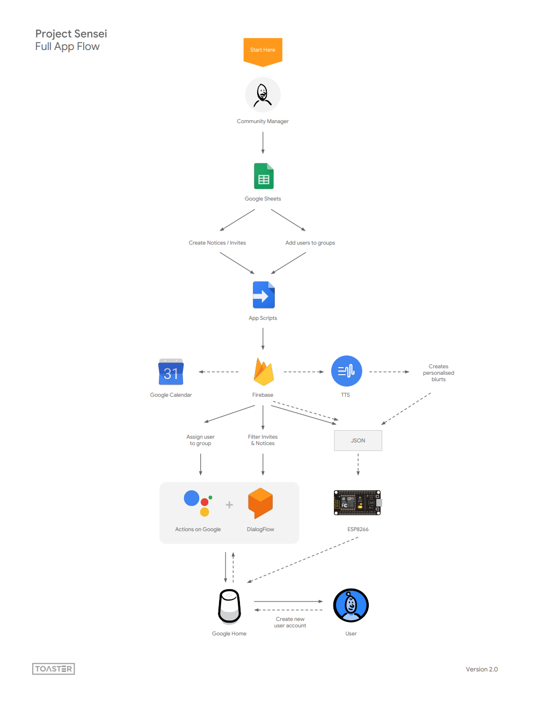

This repo contains everything you need to create your own community noticeboard. We won't go into all the details but you can explore the source code of each part to learn how it all works together. The below instructions allow you to build your own community management tool from scratch. 

### Before you start
1. Clone this repo
2. Make a copy of this [sheet](https://docs.google.com/spreadsheets/d/1Vo6eGPo3gIH3JPdAoJEB1AkyF781m__g_PGBlIXqwGU/edit#gid=0)
3. Go to [Firebase](https://firebase.google.com/) and login.
    * If you don't have an account it's free to sign up and use.
4. In Firebase Console add a new project
    * Give it a name e.g. Community Keijiban
    * Select your locations and agree to the T&Cs
    * Press `Create project` then `Continue` once its created
5. Go to `Develop > Storage` and press `Get Started` and follow the prompt.
6. In `Storage` create a folder called `audio` 
7. Then go to the `rules` tab and replace the current rules to allow public reads, using the below code (Press `Publish` to save): 
    ```JavaScript
    service firebase.storage {
        match /b/{bucket}/o {
            match /{allPaths=**} {
                allow write: if request.auth != null;
                allow read;
            }
        }
     }
    ```
8. Go to `Develop > Database`, scroll down the page and find `Or choose Realtime Database` and click `Create Database` and then click `enable`
9. Now go to your `⚙︎ > Project Settings > General` in Firebase
10. Make a note of your `Project ID`
11. Then go to your `⚙︎ > Project Settings > Service Accounts` in Firebase and select `Database secrets`
12. Then press `show` and make a note of your `Database secret`

### Setup the Sheet
1. Open the sheet you copied.
2. Go to `Tools > Script Editor`
3. Inside Script Editor select the file `Code.gs` and replace the following values:
    * `[PROJECT-ID]` with your `Project ID`
    * `FIREBASE_DATABASE_SECRET` with your `Database secret`
4. Save the changes 
5. Go to `File > Project Properties > Info` and make a note of the `Project key` 
5. Close the Script Editor
6. Refresh the Google Sheet

### Setup Firebase
1. Download and install [Firebase CLI](https://firebase.google.com/docs/cli/). Once you have completed step 4 under "Install the Firebase CLI" continue with the below steps.
2. You need to initialize a new Firebase project, run the following command from within your project's directory `firebase init` and follow the on screen intructions. **For most options you can use the defaults except for the below**:
    * Select `Functions` and `Hosting`
    * Select the project name you created via the Firebase Console e.g. `Community Keijiban`
        * If your project name is not listed select `create a new project` and after `firebase init` has completed you can use `firebase use --add` to add your project name
    * Select `JavaScript` for the `Functions` language
    * Say yes to enforce ESLint style
    * When asked to overwrite `package.json`, `.eslintrc.josn` and `index.js` say No
3. Now you need to customise the functions for your use. Open `functions/config/constants.js` in your preferred IDE. In `constants.js` you will need update the values of the below properties. The other props in the file can also be updated but those are optional.
    * For `AUDIO_FILE_BUCKET_URL_PREFIX` and `GOOGLEAPI_REDIRECT` replace `[PROJECT_ID]` with your Firebase project ID
    * For `API_ORIGIN_WHITELIST` replace `[APPSCRIPT_PROJECT_KEY]` with your AppScripts `Project key`
4. Now open `functions/language/blurts.json`. The strings in this file are used by [Cloud Text-to-Speech](https://cloud.google.com/text-to-speech/docs/) to create the blurts. You can modify these to match your project's needs.
5. Rename the folder `functions/keys-sample` to `functions/keys`
6. Now open the project root in `Terminal` or `Command Line` and type `firebase deploy`
7. Once deployment has finished note down the `Hosting URL` (e.g. `https://[PROJECT-ID].firebaseapp.com`) and the domain of the `Functions URL` (e.g. `us-central1-[PROJECT-ID].cloudfunctions.net`)

### Enable APIs and Create Credentials
1. Go to [Google Cloud Console](https://console.cloud.google.com), make sure to login using the same account you used to setup Firebase
2. Select the project name you created in Firebase


3. Go to `APIs & Services > Library`
4. Search for `Cloud Text-to-Speech API`
5. Select it and then press the Enable button.
    * If you have not enabled billing you will be prompted to enable it. Follow the on-screen instructions to enable billing 
6.  Go back to `APIs & Services > Library` and search for `Google Calendar API`
7. Select it and press the Enable button
8. Go to `APIs & Services > Credentials > OAuth consent screen`

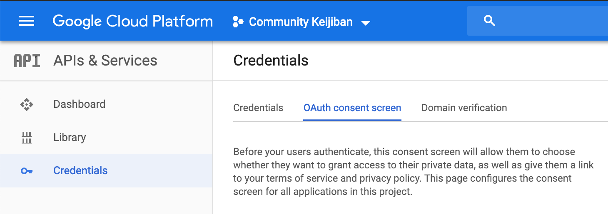

9. Under `Support email` select an email address 


10. Scroll down add the `Functions URL` domain under `Authorized domains`. For example: 	
`us-central1-[PROJECT-ID].cloudfunctions.net`

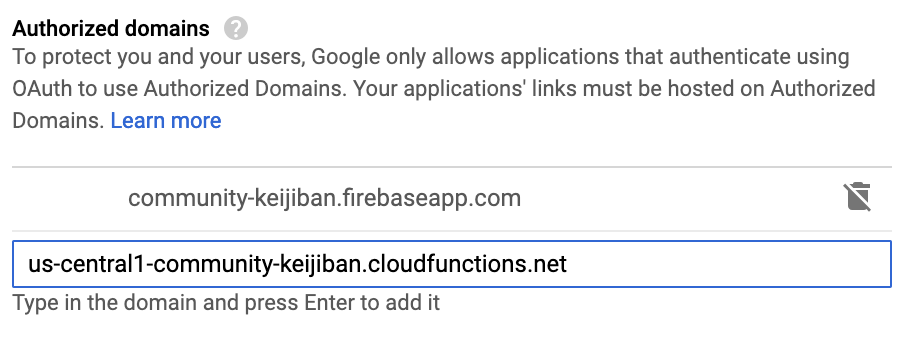

11. Then add the `Hosting URL` to `Application Homepage link` and `Application Privacy Policy link`. . For example: 	
`https://[PROJECT-ID].firebaseapp.com`. Then press save.

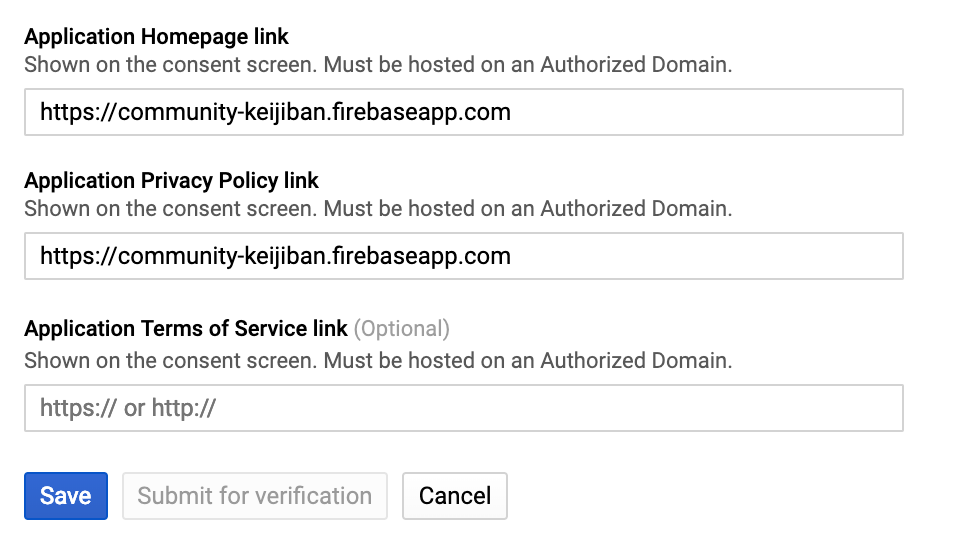

11. This should redirect you back to `APIs & Services > Credentials`. Under `OAuth 2.0 client IDs` click on `Web client (auto created by Google Service)`


12. Under `Authorized redirect URIs` add `https://us-central1-[project-id].cloudfunctions.net/oauthcallback` replacing `[project-id]` with your Firebase project ID. Then press save.

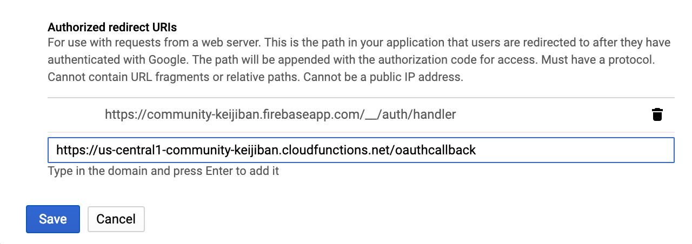

13. This should redirect you back to `APIs & Services > Credentials`. Now under under `OAuth 2.0 client IDs` download the JSON file for `Web client (auto created by Google Service)` 
14. Rename the file to `calendar.json` and place into your project folder under `functions>keys`. You may need to create the `keys` folder if you do not have it or you may need to replace `calendar.json` if one already exists.
15. Go back to `Google Cloud Console` and open `APIs & Services > Credentials` and select `Create credentials > Service account key`
16. Create `New Service account` and name it `TTS`. Make sure the key type is set to `JSON` and role is set to `Project > Owner`. Then press `Create`
17. The JSON will autodownload. Rename it to `tts.json` and place into your project folder under `functions > keys`.
18. Now open the project root in `Terminal` or `Command Line` and type `Firebase deploy`

### Setup Dialogflow and Google Assistant Intergration
1. Go to [Dialogflow](https://dialogflow.com/) and login using the same account you used to access Firebase.
    * If you don't have an account it's free to sign up and use.
2. Create a new agent
    * Give it a name e.g. `CommunityKeijiban`
    * Set the agent's default language and timezone
    * For Google Project select the Firebase project you just created e.g. `community-keijiban`
    * Press "Create"
3. Once created select the newly created agent and go to the settings page
4. Click on `Export and Import`
5. Click `IMPORT FROM ZIP`, select the file `assets/dialogflow.zip` from your project folder and type the word IMPORT to enable the import button.
    * After importing if `ja` does not display under your agent name you can add it by going to `Languages` in the Agent settings and selecting `Japanese - ja` from the drop down.
6. Now click on `Fullfilment` and enable the `Webhook` option.
7. Then copy `https://us-central1-[PROJECT-ID].cloudfunctions.net/dialogflowWebhook`, replace `[PROJECT-ID]` with your Firebase project ID, into the URL field
8. Under `DOMAINS` select `Enable webhook for all domains` then press `Save`.
9. In Dialogflow click on `Integrations` on the main menu and then click on `Integration Settings` under Google Assistant. A modal window will popup
10. Toggle on `Auto-preview changes`
11. Click on `Test` to goto the Actions on Google console 
12. Go to `Advanced Options >Account Linking`
13. Select `Yes, allow users to sign up for new accounts via voice` and press `Next`
14. Select `Google Sign In` and press `Next`
15. Take note of the `Client ID` and then in `functions/keys` in your project folder open `constants.js`. Replace `[CLIENT-ID]` with the client ID from Actions on Google console:
```JavaScript
module.exports = {
    ACTIONS_ON_GOOGLE_CLIENT_ID: '[CLIENT-ID]'
};
```
16. Now open the project root in `Terminal` or `Command Line` and type `Firebase deploy`
17. Once deployed succesfully open a browser window and go to this website, replacing `[project-id]` with your Firebase project ID: `https://us-central1-[project-id].cloudfunctions.net/authgoogleapi`
18. The Sign-in with Google page will display. Select the account that used to create your Firebase project. Click `Allow` for prompts. If succesfull you will see: `App successfully configured with new Credentials. You can now close this page.`
19. Open `index.js` inside `functions` folder in your project folder with your prefferred IDE
20. Then comment out lines 131 to 157 (this code is used for authorising the Cal. API and is only needed once).
21. Now open the project root in `Terminal` or `Command Line` and type `Firebase deploy`

### Get the Parts (optional)
You can find the parts we used below, or use similar parts you might already have lying around.

#### Electronic stuff
* LOLIN(Wemos) D1 Mini Pro ESP8266 WiFi
* Micro USB cable (data-syncing)

#### Your device
* Google Home, Google Mini or Phone with the Google Assistant (Android or iOS devices)

### Setup the Electronics (optional)

#### Download the software
* USB Driver. The driver might be different if using a different board.
    * [CP2104 USB Driver](https://www.silabs.com/products/development-tools/software/usb-to-uart-bridge-vcp-drivers) (for LOLIN(Wemos) D1 Mini Pro)
* [Arduino IDE](https://www.arduino.cc/en/Main/Software)

#### Update Board Manager
* Open the `Arduino IDE`
* Go to `Arduino > Preferences`
* Copy and paste into the Additional Board Manager URLs field: 
http://arduino.esp8266.com/stable/package_esp8266com_index.json 
* Press OK
* Restart the Arduino IDE

#### Download microcontroller library
* Open the `Arduino IDE`
* Go to `Tools > Board > Boards Manager`
* Filter by ESP8266 and click install on `esp8266 by ESP8266 Community` version  2.4.2
* Close the Boards Manager Window

#### Download the libraries
* Open the Arduino IDE
* Go to `Sketch > Include Library > Manage Library` then filter for and install the following libraries: 
    * EasyNTPClient  (v1.1.0)
    * ArduinoJson (v5.13.4)
    * Esp8266-google-home-notifier (v1.0.6)
    * Esp8266-google-tts (v1.0.7)
    * TaskScheduler (v3.0.2)
    * DoubleResetDetect(v1.0.0) 
    * WifiManager (v0.14.0)
* Close the Library Manager window once all libraries are installed

#### Set the board
* Go to `Tools > Board`
* Select LOLIN(Wemos) D1 Mini Pro as your board or if you are holding non-pro version, choose LOLIN(Wemos) D1 R2 & Mini or any other board you are using

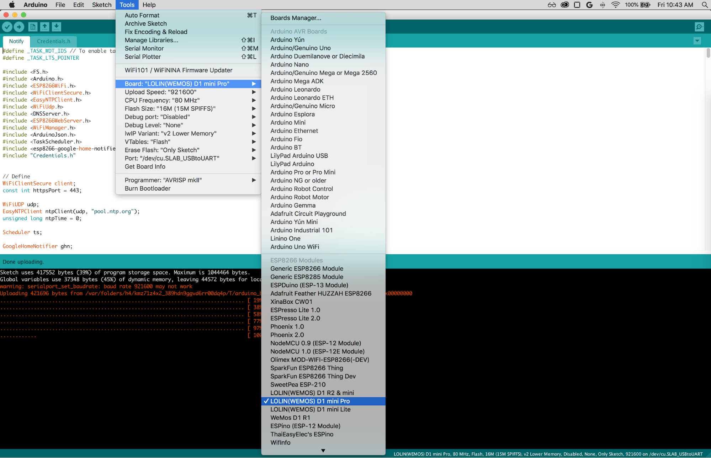
* Go to Tools > Upload Speed
* Select 921600 baud
* Go to Tools > Port
* Select the matching COM port for your USB cable. It should be something like `USB.SLABtoUART` or `/dev/cu.wchusbserial14530` or `/dev/cu.wchusbserial1420`

#### Flashing the microcontroller
1. Plug a USB B Mini into the microcontroller to power it and connect the other end of the cable into your computer.
2. Open the Notify file you downloaded from step 1 in the Prerequisites for flashing microcontroller section. Make sure you open the INO file (Notify.ino). This should open the Arduino IDE.
3. Also open `Config.h` in the Arduino IDE and replace the `[PROJECT_ID]` in `FIREBASE_URL` with your Firebase project Id. Save it.
3. Click the arrow to upload the code to your microcontroller. 

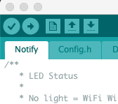

#### Connecting the microcontroller to your Wifi and Google Home
1. Open your Voice app on the Google Home
    * In English say "Talk to Notice Board"
    * **Tip:** If the Home says you do not have access or there is no action try sharing the Voice App with yourself fron Actions on Google console
2. When your app runs for the first time it will ask you to sign in. You will need to do this to use the app.
    * **Tip:** If you get stuck in a sign in loop… something like the below please check you have allowed the Assistant to use personal information. 
        * “Alright no problem- just so you know you will not be able to use your account with notice board. but you can come back and sign in again” 
3. Once signed in you can ask your app for your "Signal ID" by saying "What is my Signal ID" “登録したIDを教えて” or simply "Signal ID". The signal id is used by the microcontroller to identify your account.
    * **Tip:** It's easier to do this on the phone as it will return a written response which you can then copy for the next steps.
4. Plug a USB B Mini into the microcontroller to power it, it will boot automatically
5. Once it is booted, connect to it by searching for the WiFi SSID "Community Keijiban".
6. Once connected it will prompt you to sign in, use the password: keijiban
    * **Tip:** Use a laptop to connect to “Community Keijiban”. Once connected open a browser in Incognito/Private mode and visit http://192.168.4.1/
7. A captive portal will open and display the below, click "Configure WiFi" (if the button does not respond try pressing the physical reset button on the microcontroller) 


8. Select the SSID that the Google Home is connected to

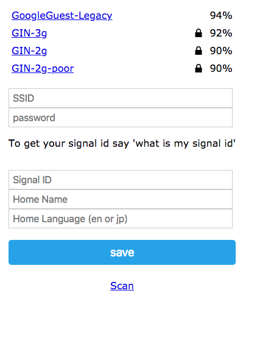

9. If password is required to access the network type that in
10. Type in the Signal ID (see step 3) all lowercase with dashes
11. Type in the Home name. You can get this from the Home App (see below screenshot) 

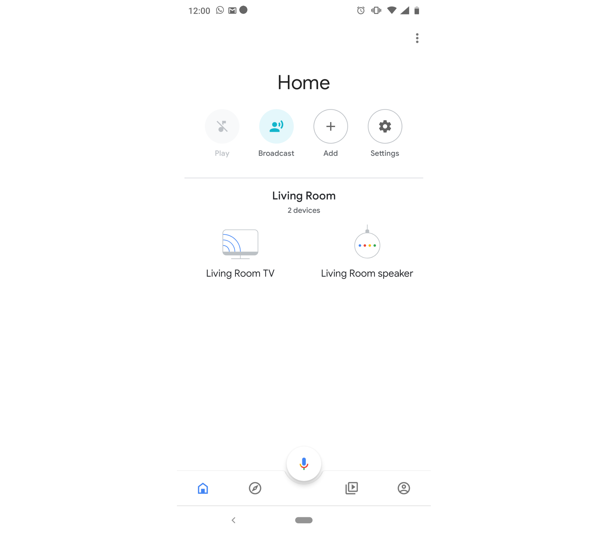

12. Type in en or jp (all lowercase)
13. Press Save.
14. The microcontroller will then restart and connect to the same network as Google Home. 
15. The Google Home will make a noise when the microcontroller has succesfully connected to it.

## Create Groups, Events and Announcements

### Create Groups
1. Open the Google Sheet you copied
2. Select the `Groups` sheet
3. Add new group name in row 1 (header)
4. Add user’s email to respective group
5. Once done, go to `Sync > Update Groups` in toolbar, if this is your first time doing it follow the on screen instructions to authorize access. 

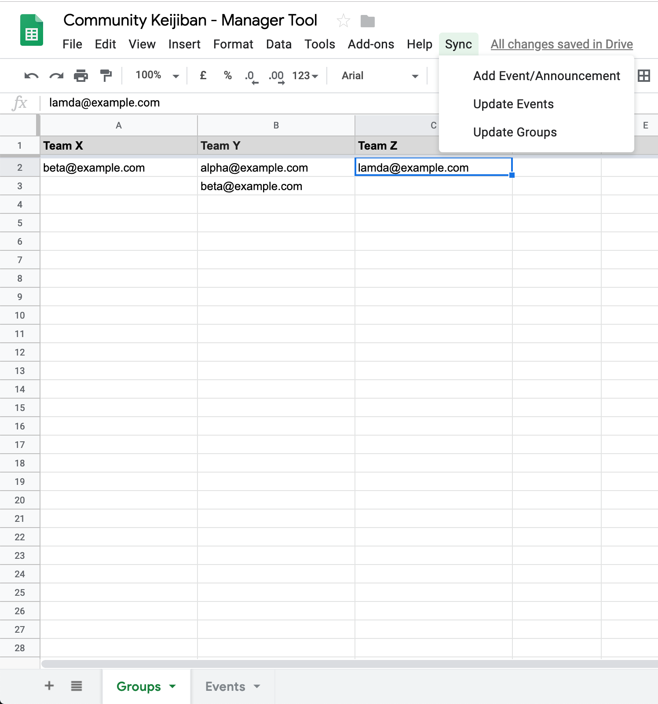


### Create Events
1. Open the Google Sheet you copied
2. Select the `Events` sheet
3. Go to `Sync > Add Event/Announcement` in the toolbar
4. A form will appear on the left side 

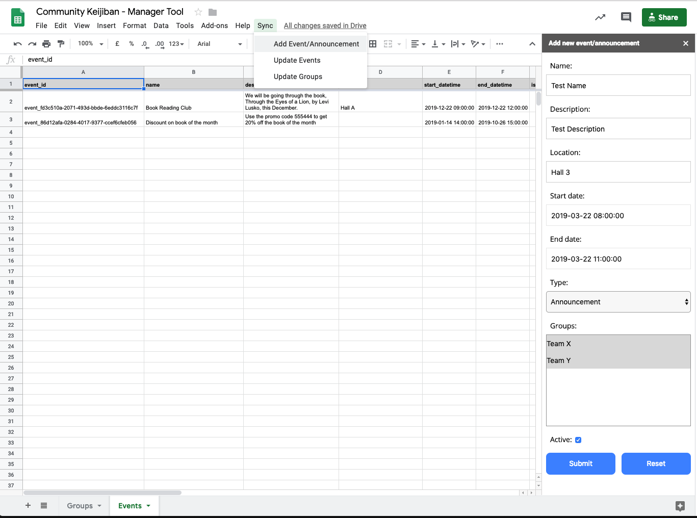

5. Enter event’s details, select the `Event` type
6. Select one or more (hold shift + click, to select more) groups of which the event belongs to
7. Check “Active” to mark the event as an active event
8. Click “Submit”
9. Once done, go to `Sync > Update Events` in toolbar, if this is your first time doing it follow the on screen instructions to authorize access.

## Testing the voice app
1. Go to the [Actions on Google Console](https://console.actions.google.com) and select your project
2. Click on `Test > Simulator` and try it out. You can also do this directly on your Google Assistant/Home that is logged in with you account.

### Extending the project
Ideas on how to extend this project
* Currently the project only supports Japanese and English. This can be extended to support other languages with a few modifcations to the code.
* Close the loop by adding an attending status on the Google Sheet

## Contributors
Made by [Toaster](https://toaster.co/) and friends at the [Google Creative Lab](https://github.com/googlecreativelab).

## License
Copyright 2019 Toaster Ltd.
Licensed under the Apache License, Version 2.0 (the "License"); you may not use this file except in compliance with the License. You may obtain a copy of the License at
http://www.apache.org/licenses/LICENSE-2.0


Unless required by applicable law or agreed to in writing, software distributed under the License is distributed on an "AS IS" BASIS, WITHOUT WARRANTIES OR CONDITIONS OF ANY KIND, either express or implied. See the License for the specific language governing permissions and limitations under the License.